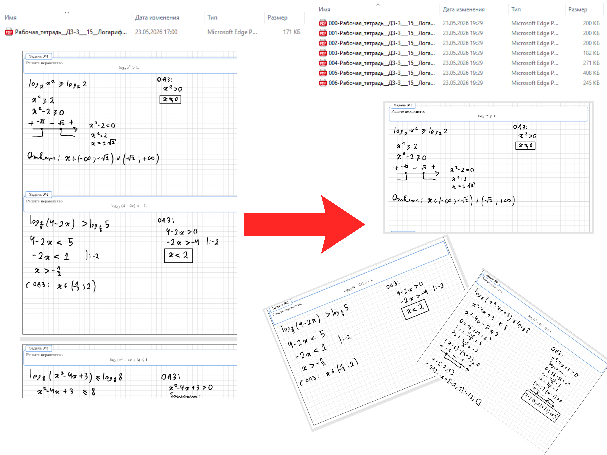

# shkolkovo-DZsplit
Устали делать и сохранять скришоты? Эта программа разрежет рабочие тетради от Школково на отдельные pdf для каждой задачи, что повысит удобство загрузки.



> [!WARNING]
> Программа работает **ТОЛЬКО** с РТ **Математика ЕГЭ и Физика ЕГЭ** в формате `.pdf`, где исходный текст ("Задача") можно выделить мышкой (после графического планшета или с корректным распознаванием текста/OCR). Скрины, фотографии и файлы, экспортированные как «pdf-рисунок» (где текст не выделяется), **НЕ поддерживаются**.


## Инструкции по использованию

### Установка собранного варианта для Windows (рекомендуется)

Скачайте во вкладке releases ->

Или по прямой ссылке
```
https://github.com/Hong-Chai/shkolkovo-DZsplit/releases
```


### Установка локально (для остальных OS)

1. Убедитесь, что в вашей системе установлен [Python 3.10+](https://www.python.org/downloads/).

2. Клонируйте репозиторий или загрузите исходный код.
    ```bash
    git clone https://github.com/Hong-Chai/shkolkovo-DZsplit.git
    cd shkolkovo-DZsplit
    ```
3. Создайте виртуальное окружение:
    ```bash
    # On macOS/Linux
    python3 -m venv venv
    source venv/bin/activate

    # On Windows
    python -m venv venv
    venv\Scripts\activate
    ```
4. Установите requirements:
    ```
    pip install -r requirements.txt
    ```
5. Чтобы запустить приложение, перейдите в каталог проекта и выполните:
    ```
    python main.py
    ```
